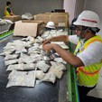

# Project Portfolio – Fajri Ilham Mughni

**Brief Description:**  
A historical and spatial documentation of several multidisciplinary projects conducted from 2022 to the present. This project includes a collection of maps, field documents, photo archives, and metadata relevant to the geographical and historical context of each area.

---

## 🧾 Project Contents

- **Metadata**  
  A list of all essential documents and files: `metadata.csv`

- **Summary**  
  An overview of the project context and document contents: `ringkasan.xlsx`

- **Preview**  
  Low-resolution visual snippets to help users understand the content before downloading the full dataset.

- **Full Dataset (Drive)**  
  Due to GitHub file size limitations, large files are hosted on Google Drive:

  🔗 [Access Google Drive Folder](https://drive.google.com/drive/folders/1V8aFvsEjfxd30Ys0MHzfVACKO_TuJW8Q?usp=drive_link)

- **📁 Data Science Portfolio**  
  A separate submodule containing exploratory data science projects such as Indonesian recipe modeling, spatial segmentation, social analysis, and more.  
  🔗 [Open Data Science Portfolio](https://github.com/Fajrimughni/data-science-portfolio)

---

## 🖼️ Visual Preview

  
  

  
  

_For more visuals, see the full [Preview Folder](./preview)_

---

## ⚙️ License & Copyright

Copyright and file access are subject to the contributor's terms. Please credit the author when using any part or all of this content.

---

## 📬 Contact

Fajri Ilham Mughni  
📫 Fajriilhammughni@gmail.com